<h1 align="center">Apple Hub</h1>

<h3 align="center">It's a MERN Stack E-commerce web application with all the major functionalities</h3>

 

<h2 align="center">🖥️ Tech Stack</h2>

<h4 align="center">Frontend:</h4>

  
  
  
  
  
  
  

<h4 align="center">Backend:</h4>

  
  
  

<h4 align="center">Deployed On:</h4>

  
 

<h3 align="center"><a href="https://finestshave.vercel.app/"><strong>Want to see live preview »</strong></a></h3>

 

   &#10023;
  <a href="#Demo">View Demo</a> &#10023;
  <a href="#Getting-Started">Getting Started</a> &#10023; 
  <a href="#Install">Installing</a> &#10023;
  <a href="#Contact">Author</a> &#10023;

It’s Solo project where I've used MERN stack to make the FinestShave with creativity along with frontend and backend integration
its Fully Responsive e-commerce web application that allows you to buy Products. It has a variety of categories, just visit the product listing page and you will see all the products, apply filters as per your need and in just a few clicks you can buy any products from the website. This project is just for educational purpose.

<!--  -->

 

## Home Page

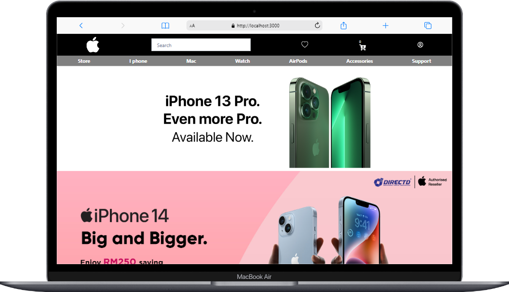
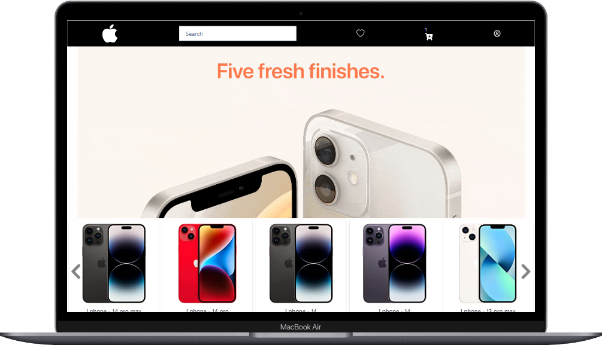
 

## Login

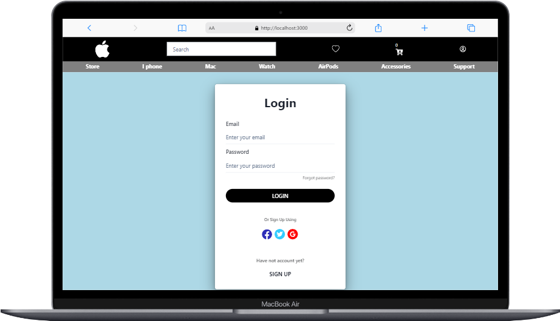

 

## SignUp

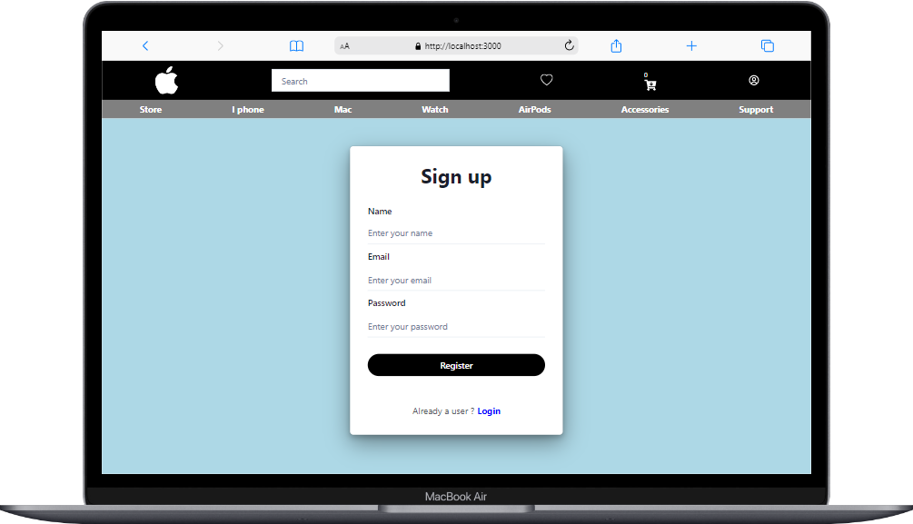
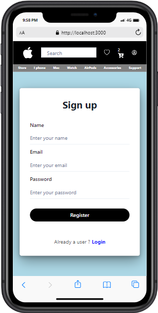
 

## Products Page

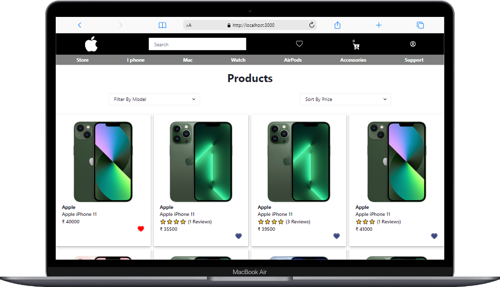
 

## Mobile Screen

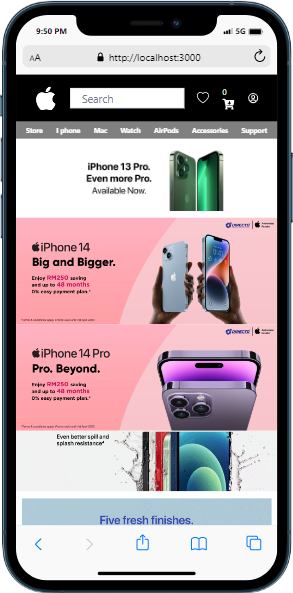

 

## Single Products Page

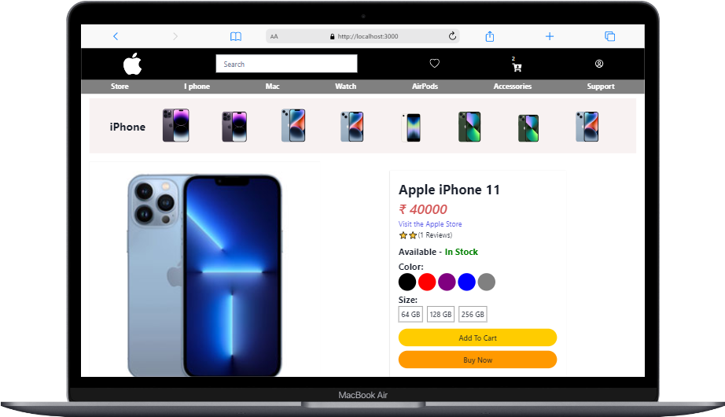
 

## WishList Page

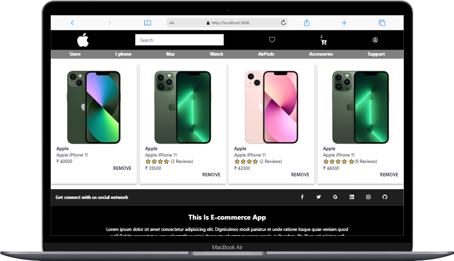
 

## Cart Page

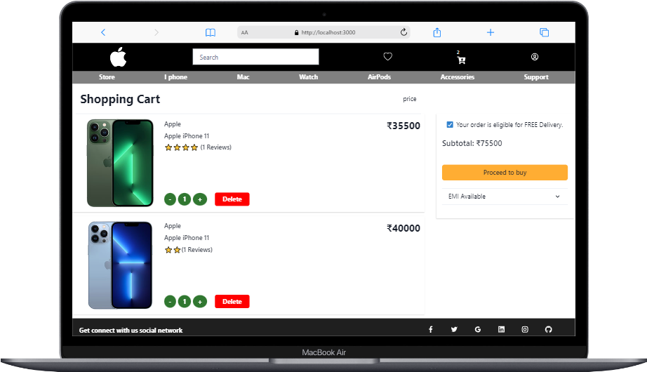

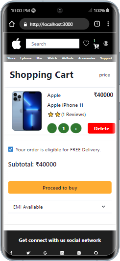
 

## Getting Started

This project was built using React, Chakra UI, HTML, CSS, JavaScript, Rest API . It is an e-commerce web application and for running on your local environment you should follow these guidelines.

## Contact

loharjayprakash4@gmail.com

+91 8875140357

© 2023 Jay Prakash Lohar

## Show your support

Give a ⭐️ if you like this project!
